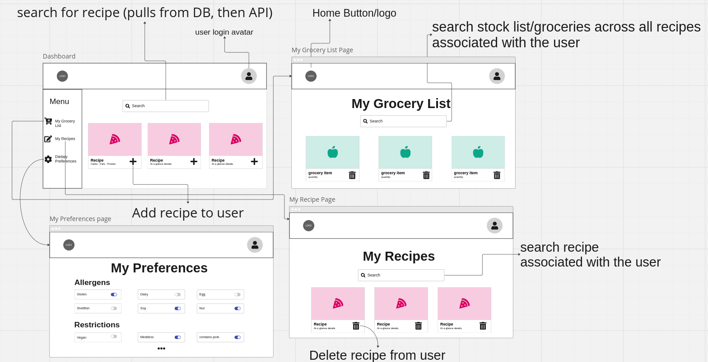
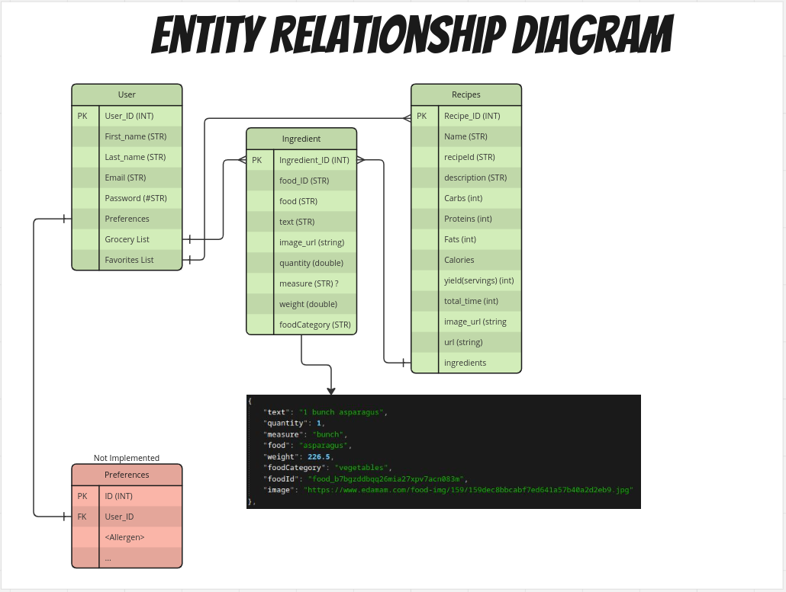
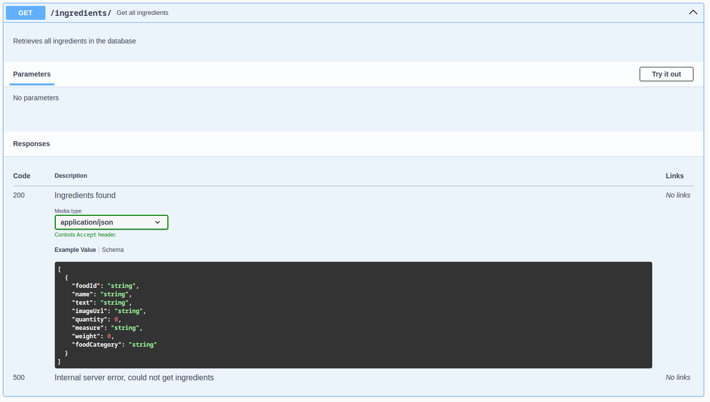
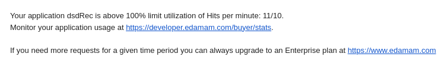
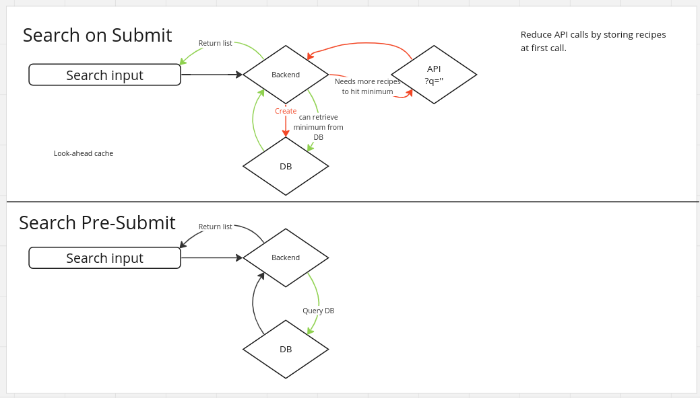

Jump straight to the TLDR: <a href="#tldr">TLDR</a> <br />

This is a reflection on my part in the DSD spring 2024 cohort.<br />
We had a larger than normal group, with two leads and eight contributors. Some of the restrictions we had were a time limit of six weeks, design decisions were decided by majority vote, pull requests needed to be approved by at least two people, and all the complexity that comes with the schedules of ten participants.

## About the Project

Given an initial list of four product descriptions, our group decided to choose the project that was most relevant and usable personally.<br />

> Grocery Management tool with built-in Recipe integration and macro counter. This tool will analyze the groceries you have on hand, can help build out a grocery list for things to get for meal prepping for the week, and give a detailed list of macros such as protein, carbs, etc. If a user puts in the items they have in the fridge, it can generate a list of recipes based on those ingredients.

<!-- TABLE OF CONTENTS -->
<details>
  <summary>Table of Contents</summary>
  <ol>
    <li>
      <a href="#about-the-project">About The Project</a>
      <ul>
        <li><a href="#the-team">The Team</a></li>
        <li><a href="#built-with">Built with</a></li>
      </ul>
    </li>
    <li>
      <a href="#planning-and-implementation">Planning and Implementation</a>
      <ul>
        <li><a href="#week-1-concept-and-planning">Concept and Planning</a></li>
        <li><a href="#week-2-setup">Setup</a></li>
        <li><a href="#week-3-5-implementation">Implementation</a></li>
        <li><a href="#week-5-refine-and-deploy">Refine and Deploy</a></li>
        <li><a href="#week-6-prepare-for-demo">Prepare for Demo</a></li>
      </ul>
    </li>
    <li><a href="#my-part-in-the-project">My Part in the Project</a></li>
    <ul>
        <li><a href="#reflections">Reflections</a></li>
        <li><a href="#outcome">Outcome</a></li>
    </ul>
    <li><a href="#links">Links</a></li>
    <li><a href="#acknowledgments">Acknowledgments</a></li>
    <li><a href="#tldr">TLDR</a></li>
  </ol>
</details>

### The Team

<table align="center">
  <tr>
    <td align="center"><a href="https://github.com/bethanyann"><br /><sub><b>Bethany Ann</b></sub></a><br />👑</td>
    <td align="center"><a href="https://github.com/wcouturiaux"><br /><sub><b>Will Couturiaux</b></sub></a><br />💻</td>
    <td align="center"><a href="https://github.com/bduran04"><br /><sub><b>Belle Duran</b></sub></a><br />💻</td>
    <td align="center"><a href="https://github.com/seishinleblanc"><br /><sub><b>Seishin LeBlanc</b></sub></a><br />💻</td>
    <td align="center"><a href="https://github.com/sohostory"><br /><sub><b>Hoyoung Lee</b></sub></a><br />💻</td>
    </tr>
    <tr>
    <td align="center"><a href="https://github.com/coffee2theorems"><br /><sub><b>Ryan Monaghan</b></sub></a><br />👑</td>
    <td align="center"><a href="https://github.com/KINYUI1"><br /><sub><b>Clement Kinyui Ndimuangu</b></sub></a><br />💻</td>
    <td align="center"><a href="https://github.com/dissurender"><br /><sub><b>Rhyn Ogg</b></sub></a><br />💻</td>
    <td align="center"><a href="https://github.com/humayoonrafei"><br /><sub><b>Humayoon Rafiei</b></sub></a><br />💻</td>
    <td align="center"><a href="https://github.com/em-ess"><br /><sub><b>Michelle Song</b></sub></a><br />💻</td>
  </tr>
</table>

### Built with

- [![React][React.js]][React-url]
- [![Material-UI][Material-UI]][Material-UI-url]
- [![Spring][Spring_Boot]][Spring-url]
- [![H2 Database][H2]][H2-url]

## Planning and Requirements

In the initial meeting, the group made a timeline for the project. Given the time frame, the breakdown was:

| Week  | Task              |
| ----- | ----------------- |
| 1     | Planning          |
| 2     | Setup             |
| 3 - 5 | Implementation    |
| 5     | Refine and deploy |
| 6     | Prepare for demo  |

### Week 1 - Concept and Planning

Starting with the product description, the group spent the first half of the week writing user stories and what we would like to see in an application like this. We also made the decisions on the tech stack, landing on the front-end using [React](https://reactjs.org/) and with [Material-UI](https://mui.com/), and the back-end using [Spring Boot](https://spring.io/) and [PostgreSQL](https://www.postgresql.org/).

The second half of the week was for boiling down the user stories into a list of requirements and tasks that we would like to accomplish for the MVP.



### Week 2 - Setup

Getting everyone on the same page tech wise, this is where we switched from [PostgreSQL](https://www.postgresql.org/) running on a [Docker](https://www.docker.com) container to [H2 Database](https://www.h2database.com) due to the resource constraints of some devices. We made this change to allow all team members to be able to run a database while developing the application.<br />
<br />
The caveat to this decision was that the database was no longer persistent when restarting the backend process, meaning the initial data needed to be bootstrapped.

```java

  @Override
  public void run(String... args) throws Exception {

    System.out.println("Number of users: " + userRepository.count());

    if (userRepository.findAll().isEmpty()) {
      System.out.println("Loading bootstrap data...");

      UserEntity user = new UserEntity();
      user.setFirstName("Johnny");
      user.setLastName("Test");
      user.setEmail("test@test.com");
      user.setPassword(utility.encryptString("?/////////////?"));
      userRepository.save(user);

      user = new UserEntity();
      user.setFirstName("Mittens");
      user.setLastName("Gato");
      user.setEmail("definitelynotacat@feline.online");
```

During the process of week one and two, we were translating the user stories and tasks onto a Github project board and assigning tags and priorities.

### Week 3-5 - Implementation

Using the Github Project Board, we were able to discuss and track issues everyone was working on asynchronously. Development on the project saw a few bumps when we were actually implementing some of the features we wanted to include. This resulted in a few priority shifts as we went to ensure we hit MVP within our time limit.



_I have to note that implementation was delay until week 4 due to the group constraints on design choices and getting a feel for the group dynamics. More on this in my [reflections](#reflections)._

### Week 5 - Refine and deploy

Implementation did bleed into this phase as our manual QA sessions were bringing bugs to our attention and the resulting squashing session. Overall, the refining allowed us to determine our remaining time and what we could sneak into the MVP.



### Week 6 - Prepare for demo

With the anticipation that we would present live at a bi-monthly DSD meetup, we had _two minutes_ to demo the application in front of an audience. Unfortunately, tech issues at the meetup resulted in most of the time slot being displaced.

### Demo

[](https://youtu.be/iOJAwqXE1l0)

## My Part in the Project

My intentions going into this cohort was to take a full-stack approach and learn from the others to have a stronger grasp on the front-end. I was looking to get more experience working as a member of a team and follow the loose scrum/agile methodologies set up by our team leads.<br />

My preconceptions were not quite on the mark this time. I was hoping that in a group this large, a natural hierarchy would evolve as we interacted and I could quietly take issues and squash bugs on the front-end and back-end. What I did not anticipate, was that I would be the one to fill the position for being in charge of the back-end almost in its entirety. My availability allowed me to spend more time in the code base and my desire to help the rest of the team understand and learn what we were doing with Spring Boot pushed me into a position of a pseudo-lead on the back-end. This meant writing tickets, documentation for topics the others were not 100% on, and dolling out issues to other team members when they asked where help was needed.

_links to some of the docs written:_

- [Spring Boot data flow](https://github.com/Dissurender/spring-dataflow/blob/main/README.MD)
- [Idea Java Quick start](https://github.com/Dissurender/idea-config/blob/main/ideaC_quickstart.md)
- [API Details](https://github.com/Dissurender/dsd-api/blob/main/APIDETAILS.MD)

### Reflections

My lead [Ryan](https://github.com/coffee2theorems) said at the start of the cohort, "You get out of this what you put into it" ... So I put an incredible amount of my time and knowledge towards this project. But beyond that, the following is my reflections:

The quantity of my contributions to the project left me worried that I was stepping over my team and their opportunities to learn, but opposed to that was my desire to have something at the end of the project that I could stand in front of and talk about with pride to my peers.

Experiencing the team dynamics in a group this size was a great learning opportunity for me. Seeing the process through from concept to something that worked and all the steps to get from one to the other. Having our team leads to guide us along the way without making decisions for us was a great catalyst for me to figure out the solutions to problems as they came up and which solution made sense with our tight time frame to hit MVP.

As someone that is making the transition into tech, while also going back to college to get the paper to prove what I already know, I want to be efficient with my time and the scope of my learning. Sure, I would really love to use Go in projects that I show off but Go is not in the entry-level market locally right now. So this project was important to me, because I could make progress in what is used locally and share knowledge with my team along the way.

While we did not hit every feature that was planned and had to cut a few corners to get the desired functionality in time(sorry to any security focused readers), I have something I can talk about to others and ask questions about things I had not thought about prior to this project and that is something to really be proud of going forward.

## TLDR

DSD Cohort project with a large group of devs. Found myself with more responsibility in the group than anticipated, but stepped up in hopes that my efforts into the project would bare results. Great learning experience from a wonderful dev community!

| What I wanted           | What I got            |
| ----------------------- | --------------------- |
| Full-stack code slinger | In charge of Back-end |

### Things I learned along the way

- Further expanding my Spring Boot knowledge
- Endpoint etiquette and normalization
- Separating my domains to promote maintainable code
- Consuming data from external APIs in Java
- A LOT of git practice

### Issues I encountered

- Constant rate-limits on external API made testing difficult
  
- Developing with H2 can be difficult with the data flow I made
- AuthN/AuthZ dependency methods I am familiar with being depreciated
- Not having the bandwidth to fully implement features I conceptualized

### Things I am proud of

- A small 'look-ahead cache' with H2 and Edamam API
- onLoad logic from front-end to populate Autocomplete list in search component on front-end
  
- A http response to Entity pipeline in Java
- Making clean endpoint docs with [Swagger UI](https://swagger.io) and [Springdoc](https://springdoc.org)
- Hiding a teacup and other easter eggs

### Future?

I made a personal fork of the project to test myself in re-imagining the frontend and to port the backend to Nodejs so I could prototype server features over the next few weeks before trying to implement them in Spring Boot.

Goals of doing this:

- Implement middleware functions to handle logging
- Migrate database to [PostgreSQL](https://www.postgresql.org/)
- Set up events to help populate database
- Rate limit external calls to avoid breaking call limits
- Migrate backend to cloud provider

## Links

- View the final progress of the project at code cutoff: [GAIA](https://github.com/bethanyann/dsd-cohort-2024)
- View progress on my personal fork on Github: [getAIA](https://github.com/getGAIA/gaia)

## Acknowledgments

- Two awesome leads: [Bethany Ann](https://github.com/bethanyann) and [Ryan Monaghan](https://github.com/coffee2theorems)
- [Dallas Software Developer Community](https://www.meetup.com/dallas-software-developers-meetup/)

[Material-UI]: https://img.shields.io/badge/Material-UI-000000?style=for-the-badge&logo=material-ui&logoColor=white
[Material-UI-url]: https://mui.com/
[React.js]: https://img.shields.io/badge/React-20232A?style=for-the-badge&logo=react&logoColor=61DAFB
[React-url]: https://reactjs.org/
[Spring_Boot]: https://img.shields.io/badge/Spring_Boot-F2F4F9?style=for-the-badge&logo=spring-boot
[Spring-url]: https://spring.io/projects/spring-boot
[H2]: https://img.shields.io/badge/H2-000000?style=for-the-badge&logo=h2&logoColor=white
[H2-url]: https://www.h2database.com
